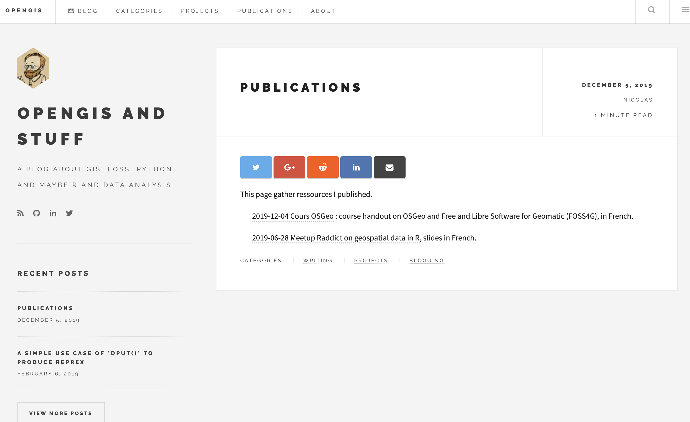

class: inverse, center, middle

# Meeting R Markdown extensions

### Ania Alay
**R-Ladies Barcelona | 2019/12/12**

---
# What can you do with R Markdown? 

##  Almost everything 

### Presentations
### Documents
### Websites
---
# Presentations
## Multiple options and frameworks exist
.pull-left[
+ ###  ioslides
+ ### slidy
+ ### beamer
+ ### xaringan
+ ### reveal.js
]
.pull-right[
   
   
  
   
   
]

---
# Documents

+ ### Journal articles
+ ### Books 
+ ### CVs 
---
# [rticles](https://bookdown.org/yihui/rmarkdown/journals.html)

---
#   [bookdown](https://bookdown.org/yihui/bookdown/) 

---
#   [bookdown](https://bookdown.org/yihui/bookdown/) 

Authoring with R Markdown allows you to cross-reference, manage citations, embed shiny apps or HTML widget, etc. 

The publication can be exported to HTML, PDF, and e-books (e.g. EPUB)

And [thesisdown](https://github.com/ismayc/thesisdown) to write your thesis!
---
#   [vitae](https://pkg.mitchelloharawild.com/vitae/) 

---
#   [vitae](https://pkg.mitchelloharawild.com/vitae/) 

---
#   [vitae](https://pkg.mitchelloharawild.com/vitae/) 

---
# Websites

+ ### Dashboards
+ ### Package documentation
+ ### Blogs

---
# [flexdashboard](https://rmarkdown.rstudio.com/flexdashboard/) 

---
# [flexdashboard](https://rmarkdown.rstudio.com/flexdashboard/) 

---
#  [pkgdown](https://pkgdown.r-lib.org)

---
#  [blogdown](https://bookdown.org/yihui/blogdown/)
For inspiration you can check out <https://awesome-blogdown.com/>, a list of [#rstats](https://twitter.com/hashtag/rstats?src=hashtag_click) blogs with blogdown `r emo::ji("tada")`

---
#  [blogdown](https://bookdown.org/yihui/blogdown/)

---
#   [blogdown](https://bookdown.org/yihui/blogdown/)

---
#  [blogdown](https://bookdown.org/yihui/blogdown/)

---
# Bonus slide!  [workflowr](https://jdblischak.github.io/workflowr/)

### Organize your project, build analyses websites, share results...

<a href="https://www.youtube.com/watch?v=O1wv94sZfvE">Demo video</a>

---
class: center, middle

<b>Thanks!</b>

Slides created via the R package [**xaringan**](https://github.com/yihui/xaringan).
